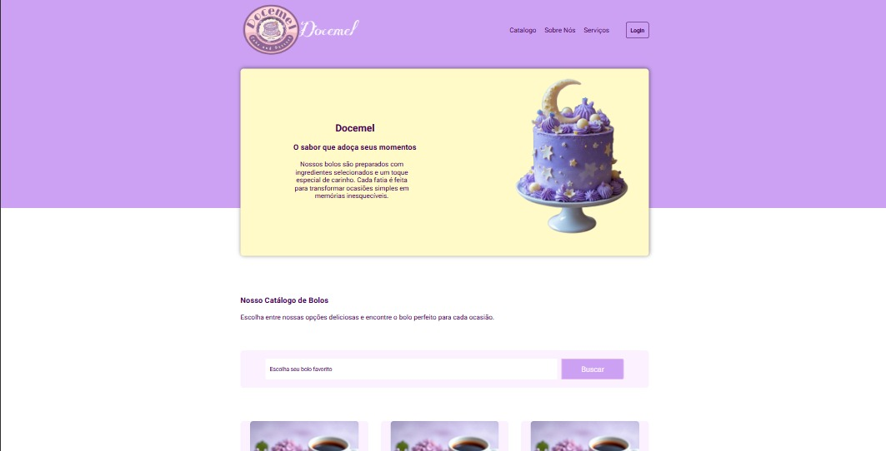

# 🍰 Docemel – Landing Page de Bolos

Projeto Front-End de uma landing page para uma confeitaria fictícia, desenvolvido com foco em layout, responsividade e organização visual utilizando apenas HTML e CSS.

## 🖥️ Demonstração
🔗 Site online: https://cake-page-xi.vercel.app/  
🔗 Repositório: https://github.com/mellacer/Cake-Page

## 📸 Preview


## 🛠️ Tecnologias Utilizadas
- HTML5
- CSS3

## ⚙️ Funcionalidades
- Página institucional com seções bem definidas
- Catálogo de bolos com cards informativos
- Seção “Sobre Nós” com apresentação da marca
- Seção de serviços oferecidos
- Footer com informações de contato e redes sociais
- Layout totalmente responsivo para diferentes tamanhos de tela

## 📚 Objetivo do Projeto
Projeto desenvolvido com fins educacionais, com o objetivo de praticar:
- Estruturação de landing pages
- Organização semântica com HTML
- Layouts responsivos com CSS
- Uso de Flexbox e Grid
- Criação de interfaces visuais atrativas sem JavaScript

## 🎨 Design e Identidade Visual
- Seleção manual das imagens utilizadas no projeto
- Definição das cores com foco em coerência visual e identidade da interface

## 📱 Responsividade
O site foi desenvolvido de forma responsiva, adaptando layout, imagens e seções para dispositivos desktop, tablet e mobile.

## 🚀 Como executar o projeto
```bash
# Clone o repositório
git clone https://github.com/mellacer/Cake-Page

# Acesse a pasta do projeto
cd Cake-Page

# Abra o arquivo index.html no navegador
